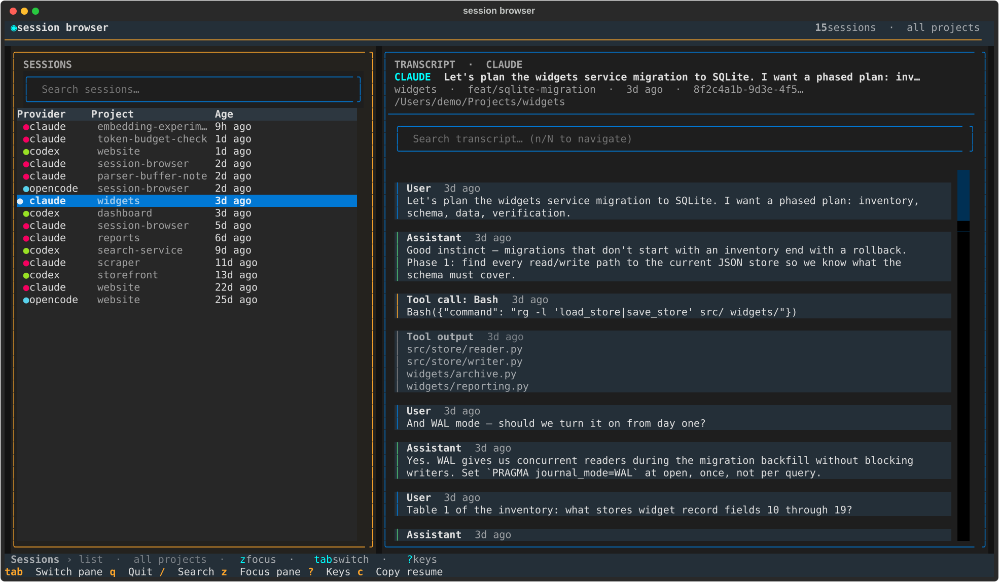
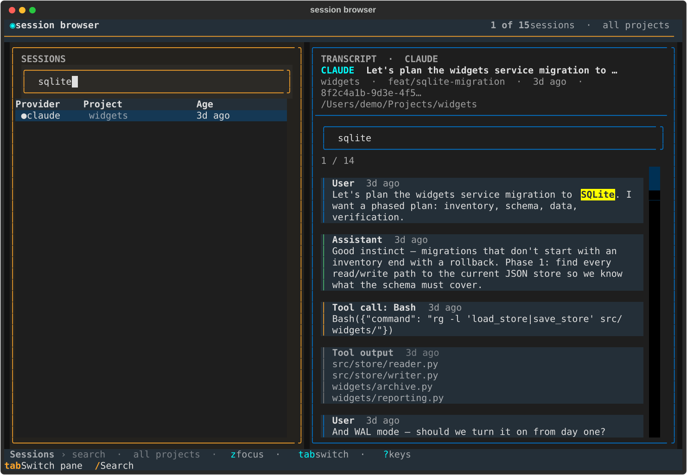
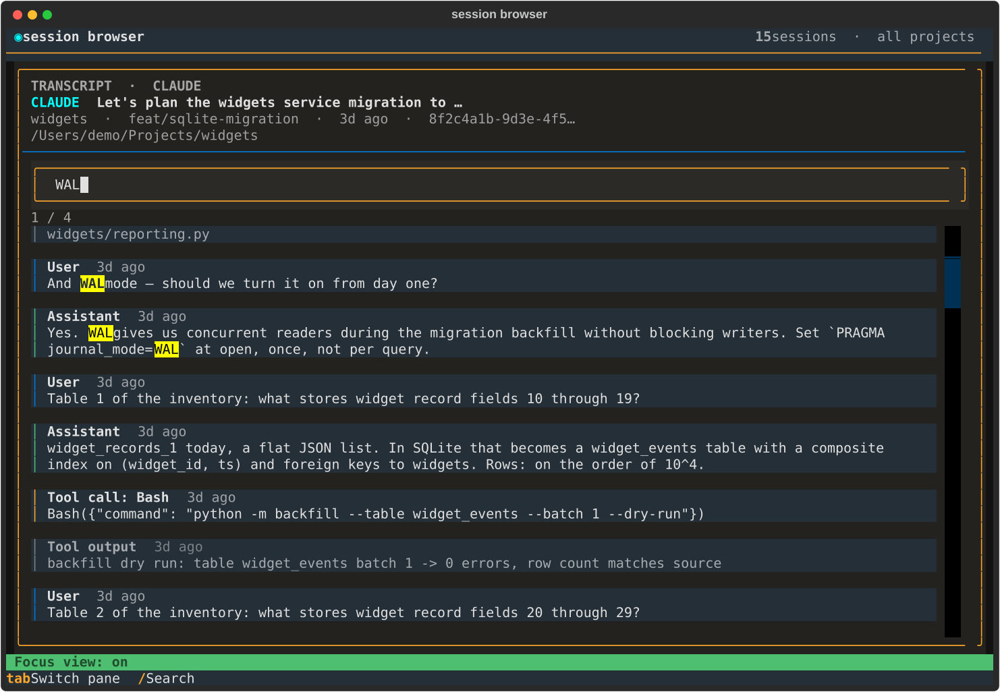

# session-browser

A terminal UI for browsing and searching agent session logs — Claude Code, Codex, and OpenCode.

## Compared with AgentsView

Session Browser searches provider-native histories directly; AgentsView imports
them into a separate archive and can add semantic search. In a small,
blind-assessed three-task comparison, Session Browser's reports were preferred
in two trials and AgentsView's in one. AgentsView used less query time overall,
but its largest saving coincided with stopping before material later evidence.

| | Session Browser | AgentsView |
|---|---|---|
| Retrieval | Directly from native session files | Imported archive; FTS and optional vectors |
| Extra services | None | Daemon; embedding service for vector search |
| Findings preference | 2 of 3 trials | 1 of 3 trials |
| Measured query time | 284 s total | 253 s total |
| Measured preparation | None | 19 s sync + 819 s embedding build |

This is a local descriptive result, not a general benchmark.

## Install

Install as a managed CLI tool (puts `session-browser` on your `PATH` via `~/.local/bin`):

```bash
uv tool install --editable .
```

`--editable` means edits to the source in this repo take effect immediately. Drop it for a pinned install. Upgrade later with `uv tool upgrade session-browser`.

## Run

```bash
session-browser
# or, without installing:
uv run session-browser
# or
python -m session_browser
```

The TUI adapts to the terminal rather than maintaining a fixed split. Wide
terminals use a capped session sidebar and a spacious transcript canvas;
medium terminals use a balanced two-pane layout; narrow terminals switch to a
full-width sessions/transcript flow. Very short windows also collapse
nonessential chrome. Press `z` to focus the active pane at any larger size.



*Wide two-pane browsing, with a selected transcript and provider-coloured
session list.*

## CLI (for agents and scripts)

Running with no arguments opens the TUI. Subcommands provide non-interactive
retrieval over the same sessions:

```bash
# Discover sessions (JSON by default, newest first)
session-browser list --provider claude --since 2026-06-01 --limit 20

# Literal search across complete transcripts (ids | snippets | full)
session-browser search "pytest fixture" --mode snippets --context 200
session-browser search "deploy" --mode full --output-dir results/

# Retrieve one complete transcript (text by default)
session-browser get claude:76458688-b620-42b0-957f-4b64e9cc784b
session-browser get 76458688-b620-42b0-957f-4b64e9cc784b --output handoff.md
session-browser get claude:7645 --format json   # unique prefix, git-style
```

Sessions are addressed as `provider:id`; a raw id works when unique, and so
does a unique prefix of either form (like git short hashes) — an ambiguous
prefix errors and lists the matching candidates.
Shared filters: `--provider`, `--repo`, `--cwd`, `--exclude-cwd`, `--here`,
`--since`, `--until`, `--include-current`, `--limit` (dates are ISO 8601 or
relative — `-30m`, `-2h`, `-1d`, `-1w`; repo/cwd are case-insensitive
substrings).
`--here` scopes to the current working directory by exact path-prefix and
reports a `warnings` entry for sessions excluded because they record no cwd.
`--exclude-cwd SUBSTR` subtracts instead of selecting — repeatable, ANDed with
`--cwd`/`--here`, and applied before `--limit` so throwaway scratch sessions
cannot consume the result budget. It is opt-in, reports what it removed in
`warnings`, and keeps sessions that record no cwd:

```bash
session-browser list --here --exclude-cwd /private/tmp/ --limit 20
```

The caller's own live session is auto-excluded by default (detected from the
agent's session-id env var, e.g. `CLAUDE_CODE_SESSION_ID` / `CODEX_THREAD_ID`,
and reported in `warnings`); pass `--include-current` to keep it.
`--output`/`--output-dir` refuse to replace existing files without
`--overwrite`; `search --output-dir` writes a `manifest.json` describing the
query, results, match counts, and any parse warnings. Errors exit nonzero
with a JSON error object on stderr when `--format json` is active.

## Demo corpus

The TUI and CLI demos poorly against a real session history — real
transcripts are messy, private, and sparse. For demos and screenshots, a
generator writes a compact but rich fake history (Claude, Codex, and
OpenCode sessions with varied dates, searchable content, one long
transcript, and scratchpad noise):

```bash
python -m session_browser.demo              # writes ./demo-home (15 sessions)
```

Everything then runs against it unchanged by pointing HOME at it:

```bash
HOME=$PWD/demo-home session-browser                        # the TUI
HOME=$PWD/demo-home session-browser list | head            # 15 sessions
HOME=$PWD/demo-home session-browser search "sqlite"
HOME=$PWD/demo-home session-browser list --exclude-cwd scratchpad
```

Timestamps are anchored to the generation time, so the corpus always looks
recent. Regenerate with `--force`; choose another directory with `--home`.
Content is invented: no real session text ever appears in the fake corpus.

The README screenshots are generated from the same corpus with Textual's
fixed-size headless driver:

```bash
python scripts/capture_demo.py
python scripts/capture_demo.py --check   # verify states without writing files
```



*Global search filters the history and highlights the matching transcript
entry.*



*`z` focus mode gives the transcript the full width for in-session match
navigation.*

## Keybindings

| Key | Action |
|-----|--------|
| `/` | Search / filter sessions |
| `s` | Find within selected session |
| `tab`, `←` / `→` | Switch sessions / transcript pane |
| `Enter`, `Esc` | Open transcript / step back |
| `z` | Toggle full-width focus view |
| `?` | Show all shortcuts |
| `p` | Toggle this-project scope |
| `n` / `N` | Next / previous match |
| `c` | Copy resume command |
| `i` | Copy session id (e.g. `claude:7645…`) |
| `t` | Open session in tmux or herdr (whichever is running) |
| `e` / `E` | Copy / export chat |
| `r` | Refresh sessions |
| `j`/`k`, `g`/`G`, `ctrl+d`/`ctrl+u` | Navigate |
| `q` | Quit |

## Development

```bash
uv sync
uv run pytest          # tests.py, test_transcript.py, test_cli.py
```
